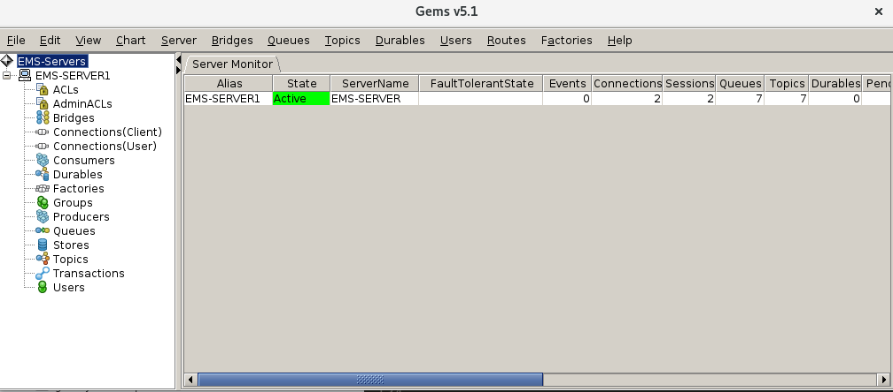

# Tibco EMS on Openshift (minishift)

Docker image and openshift yaml files to create a docker image to run inside openshift.  I run this locally on my minishift for dev purposes.  Using the NodePort ability we are able to connect to Tibco EMS.

Note: this container runs as root, which is naughty.

## Prerequisites

- A maven repository like nexus or artifactory (to download the Tibco EMS distribution from) - personally I use [vargant-nexus](https://github.com/welshstew/vagrant-nexus) on fedora
- A download of a [Tibco EMS distro](https://tap.tibco.com/storefront/trialware/tibco-enterprise-message-service/prod15032.html)
- [Tibco Gems Administration Tool](https://community.tibco.com/wiki/graphical-administration-tool-tibcor-ems-gems) in order to access the EMS Server

## Tibco EMS Installer

Ensure your maven settings are correct and upload the Tibco EMS zip file to that repository using `mvn deploy:deploy-file`

1.  Grab the linux installer : [tibco EMS Download Link](https://tap.tibco.com/storefront/trialware/tibco-enterprise-message-service/prod15032.html)
2.  Push this file into your local nexus/artifactory

```
mvn deploy:deploy-file -DgroupId=com.tibco \
  -DartifactId=tibems-installer \
  -Dversion=8.4.0 \
  -Dpackaging=zip \
  -Dfile=TIB_ems-dev_8.4.0_linux_x86_64.zip \
  -DrepositoryId=nexus \
  -Durl=http://192.168.122.50:8081/nexus/content/repositories/thirdparty/

```

Inside the `src/main/docker/Dockerfile` there is a reference to the following variables, where I have access to a Tibco EMS 8.4.0 install zip.  Change to match your installer location.

```
ARG EMS_DOWNLOAD=http://192.168.122.50:8081/nexus/content/repositories/thirdparty/com/tibco/tibems-installer/8.4.0/tibems-installer-8.4.0.zip
ARG EMS_INSTALLER_FILE=tibems-installer-8.4.0.zip
```

## Setting up certificates

If you want to use certifcates with this image:

- Create a new private server key
- Create a self signed cert

```
openssl genrsa -des3 -out server.privatekey.pem 2048
# set password to "password"
openssl req -key server.privatekey.pem -new -x509 -days 365 -out server.cert.pem

#to match values in tibemsd.conf
cp server.privatekey.pem server.key.pem

```

## How to build

```
oc new-project tibco
oc import-image rhel7 --from=registry.access.redhat.com/rhel7 -n openshift --confirm
oc create -f openshift.yml
oc new-app --template=tibco-ems
oc start-build tibcoems --follow

```

Once the build has finished, hopefully you will have a tibcoems pod up and running - check by rsh'ing into the pod and running tibemsadmin.  Only the defaults have been used - i.e. user: admin , and password: <empty> or blank

```
[user@localhost tibcoems-ocp]$ oc get pods
NAME               READY     STATUS      RESTARTS   AGE
tibcoems-1-build   0/1       Completed   0          4m
tibcoems-1-trb2d   1/1       Running     0          3m
[user@localhost tibcoems-ocp]$ oc rsh tibcoems-1-trb2d
sh-4.2# cd /opt/tibco/ems/8.4/bin/
sh-4.2# ./tibemsadmin

TIBCO Enterprise Message Service Administration Tool.
Copyright 2003-2017 by TIBCO Software Inc.
All rights reserved.

Version 8.4.0 V14 7/20/2017

Type 'help' for commands help, 'exit' to exit:
> connect
Login name (admin): 
Password: 
Connected to: tcp://localhost:7222
tcp://localhost:7222> exit
bye
sh-4.2# exit
exit
```


## Connect from outside...

In order to do this we expose the service via a node port in `nodeport-svc.yaml`, we use 31222 to forward to 7222 (the standard EMS port).  We must also get the ip of minishift in order to connect...!

```
spec:
  ports:
  - nodePort: 31222
    port: 7222
    protocol: TCP
    targetPort: 7222
```

Create the nodeport and find out the minishift ip:

```
[user@localhost tibcoems-ocp]$ oc create -f nodeport-svc.yml
service "tibcoems-np" created
[user@localhost tibcoems-ocp]$ minishift ip
192.168.42.56
```

[GEMS download](https://community.tibco.com/modules/graphical-administration-tool-tibcor-ems).  Once downloaded, unzip and alter the `Gems5.1/Gems/servers.xml` to match your minishift ip and nodeport.  from `tcp://localhost:7222` to `tcp://192.168.42.56:31222`.

```
<?xml version="1.0"?>

<EMS-Servers>
    <ConnectionNode alias="EMS-SERVER1" url="tcp://192.168.42.56:31222" user="admin" password="" autoConnect="true" logServerInfo="Always" logDir="./log" queueNamePattern="&gt;" topicNamePattern="&gt;" userNameFilter="">
	<WarnLimits Connections="2000" Sessions="20000" Queues="2000" Topics="2000" Durables="2000" PendingMsgs="1000000" PendingMsgSize="500000000" InMsgRate="5000" RespTime="500"/>
	<ErrorLimits Connections="5000" Sessions="50000" Queues="5000" Topics="5000" Durables="5000" PendingMsgs="5000000"  PendingMsgSize="4000000000" InMsgRate="10000" RespTime="1000"/>
	
	<EventMonitor maxDisplayedEvents="50" enabled="true">
	    <EventSubscription monitorTopic="$sys.monitor.limits.*"/>
	    <EventSubscription monitorTopic="$sys.monitor.server.warning"/>
	</EventMonitor>
    </ConnectionNode>
</EMS-Servers>
```

Note that GEMS requires the Tibco EMS libs stated in `rungems.sh`

```
# set the EMS root installation directory here (only client libraries required)
TIBEMS_ROOT=~/tibco/ems/8.4

TIBEMS_JAVA=${TIBEMS_ROOT}/lib
#Change to jms.jar for EMS7 or lower
CLASSPATH=${TIBEMS_JAVA}/jms-2.0.jar:${TIBEMS_JAVA}/jndi.jar
```

Get these jar files by copying them out of the container....

`oc cp <pod-name>:<file-path>.jar ~/tibco/ems/8.4`

```
mkdir -p ~/tibco/ems/8.4
oc cp tibcoems-1-trb2d:/opt/tibco/ems/8.4/lib/jndi.jar ~/tibco/ems/8.4/lib/jndi.jar
oc cp tibcoems-1-trb2d:/opt/tibco/ems/8.4/lib/jms-2.0.jar ~/tibco/ems/8.4/lib/jms-2.0.jar
oc cp tibcoems-1-trb2d:/opt/tibco/ems/8.4/lib/tibjmsadmin.jar ~/tibco/ems/8.4/lib/tibjmsadmin.jar
```

Now run gems:

```
[user@localhost Gems]$ chmod + x ./rungems.sh 
[user@localhost Gems]$ ./rungems.sh 
TIBCO Gems v5.1
TIBCO Enterprise Message Service
Copyright 2003-2017 by TIBCO Software Inc.
All rights reserved.

Version 8.4.0 V14 7/20/2017

JMS2.0 API available
JGoodies Looks: I have successfully installed the 'Desert Bluer' theme.
Connecting to: tcp://192.168.42.56:31222
```


Now you should be able to run Gems, and see you're connected to EMS in minishift:




## Connect via SSL

### Create the secure nodeport

[user@localhost tibcoems-ocp]$ oc create -f nodeport-ssl-svc.yml
service "tibcoems-snp" created

### Configure Certificates in GEMS

Ensure that you have the certificate created earlier... com.tibco.tibjms.ssl.trusted_certs

```
<ConnectionNode alias="EMS-SERVER1-SSL" autoConnect="true" password="" url="ssl://192.168.42.181:31243" user="admin">
    <SSLParam name="com.tibco.tibjms.ssl.trace" type="boolean" value="true"/>
    <SSLParam name="com.tibco.tibjms.ssl.trusted_certs" type="string" value="/home/user/GitHub/tibcoems-ocp/secret/server.cert.pem"/>
    <SSLParam name="com.tibco.tibjms.ssl.enable_verify_host" type="boolean" value="false" />
  </ConnectionNode>
```